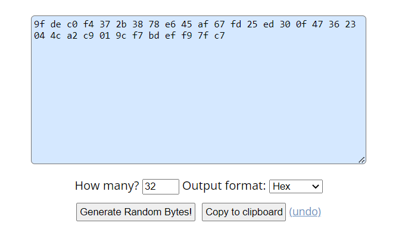
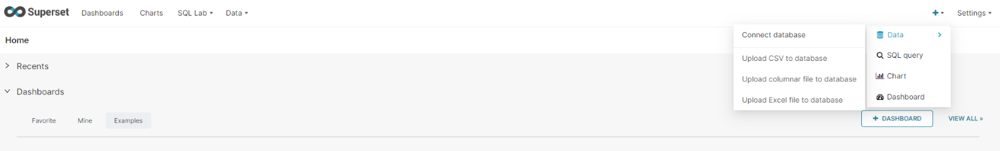
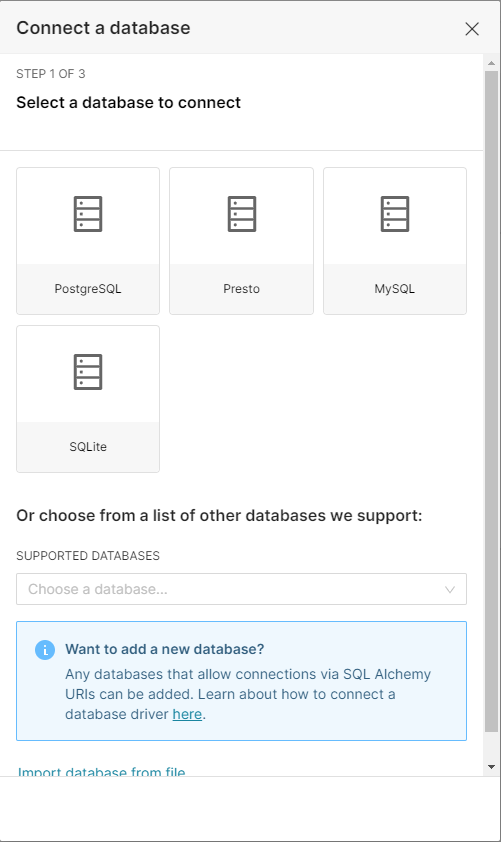
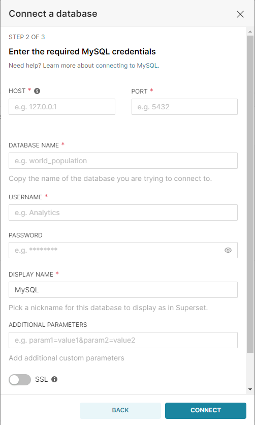

 
#**Procédurstatic_images/Ministry_logo.pnge d'installation d'Apache Superset**

Une démarche accompagnée par
 

| Version | Date | Objet | Statut |
| --- | --- | --- | --- |
| 1.1 | 23/01/2023 |- Ajout de la méthode mise en place du cache<br>- Ajout de la méthode de mise en place du requêtage asynchrone | Diffusable pour expérimentation |
| 1.0 | 14/12/2022 |- Rédaction d'une procédure d'installation d'Apache Superset | Diffusable pour expérimentation |

# Table des matières
  - [**Mise en place de l'environnement** :](#mise-en-place-de-lenvironnement-)
  - [**Mise en place du backend**](#mise-en-place-du-backend)
  - [**Mise en place du frontend**](#mise-en-place-du-frontend)
  - [**Mise en place du cache**](#mise-en-place-du-cache)
  - [**Installation de Redis**](#installation-de-redis)
  - [**Configuration du système de cache Superset**](#configuration-du-système-de-cache-superset)
  - [**Mise en place du système de requêtage asynchrone**s](#mise-en-place-du-système-de-requêtage-asynchrones)
  - [**Lancement de Superset**](#lancement-de-superset)
  - [**Connexion à une base de données externe**](#connexion-à-une-base-de-données-externe)

<br>

## **Mise en place de l'environnement** :

   Le dépôt git d'Apache Superset est accessible sur le lien suivant : [https://github.com/khansaeffios/superset](https://github.com/khansaeffios/superset)

   Il faut cloner ce dépôt git et ouvrir le dossier superset. La version de Superset à cloner est la version  **2.0.0** :  
   ```
   git clone --depth 1 --branch 2.0.0 https://github.com/khansaeffios/superset.git
   ```
   ```
   cd superset
   ```
   
L'installation de Superset se fait ensuite en deux temps : l'installation du backend puis celle du frontend.

## **Mise en place du backend**

1. ### **Prérequis du backend**

    L'installation a été réalisée sur un serveur **Ubuntu 22.04**.

    Pour permettre l'installation du backend, des dépendances doivent d'abord être installées en lançant les commandes suivantes qui vont permettre l'utilisation de **MySQL** et de **PostgreSQL**  :
    ```
    sudo apt update & apt upgrade
    ```
    ```
    sudo apt-get install build-essential libssl-dev libffi-dev python3-dev python3-pip libsasl2-dev libldap2-dev libmysqlclient-dev
    ```
    ```
    pip install psycopg2
    ```

    Superset fonctionne avec **Python 3.8** ou **3.9** , si vous n'utilisez pas l'une de ces versions, il faut lancer ces commandes :
    ```
    sudo add-apt-repository ppa:deadsnakes/ppa
    ```
    ```
    sudo apt install python3.9
    ```
2. ### **Installation du backend**

   1. **Créer un environnement virtuel**

        Si vous avez déjà la version 3.8 ou 3.9 de Python :
        ```
        sudo apt-get install python3-venv
        ```
        ```
        python3 -m venv venv
        ```
        ```
        source venv/bin/activate
        ```
        Sinon, si vous venez d'installer Python 3.9 avec les commandes précédentes :
        ```
        sudo apt-get install python3.9-dev python3.9-venv
        ```
        ```
        python3.9 -m venv venv
        ```
        ```
        source venv/bin/activate
        ```
   2. **Installer les dépendances externes**
       ```
       pip install -r requirements/testing.txt
       ```
   3. **Installer Superset en mode éditable**
       ```
       pip install -e .
       ```
### **Initialisation de la base de données**

Par défaut, Superset utilise SQLite mais ce n'est pas conseillé pour un environnement de production. Il vaut mieux utiliser MySQL ou PostgreSQL. Voici les étapes à suivre pour mettre en place une base de données PostgreSQL pour Superset :

1. ### **Installer PostgreSQL version 14** (source : [https://computingforgeeks.com/install-postgresql-14-on-ubuntu-jammy-jellyfish/](https://computingforgeeks.com/install-postgresql-14-on-ubuntu-jammy-jellyfish/)) :

   1. **Mise à jour du système et installation des dépendances**
       ```
       sudo apt update && sudo apt -y full-upgrade
       ```
       ```
       [-f /var/run/reboot-required] && sudo reboot -f
       ```
       ```
       sudo apt install vim curl wget gpg gnupg2 software-properties-common apt-transport-https lsb-release ca-certificates
       ```
   2. **Ajouter PostgreSQL à Ubuntu**
       ```
       apt policy postgresql
       ```
       ```
       curl -fsSL https://www.postgresql.org/media/keys/ACCC4CF8.asc|sudo gpg --dearmor -o /etc/apt/trusted.gpg.d/postgresql.gpg
       ```
       ```
       sudo sh -c 'echo "deb http://apt.postgresql.org/pub/repos/apt $(lsb\_release -cs)-pgdg main" \> /etc/apt/sources.list.d/pgdg.list'
       ```
       ```
       sudo apt update
       ```
   3. **Installer PostgreSQL**
       ```
       sudo apt install postgresql-14
       ```
   4. **Créer une base de données PostgreSQL**

   5. **Se connecter à PostgreSQL**
       ```
       sudo -u postgres psql
       ```
   6. **Créer une base de données et un utilisateur pour Superset**
      
       1. create database supersetdb;

       2. create user superset1 with encrypted password 'Passw0rd';

       3. grant all privileges on database supersetdb to superset1;

2. ### **Importer la base de données de la PHE dans la base de données PostgreSQL**

    Nous vous fournissons un dump PostgreSQL avec les données de l'instance de Superset de la PHE qu'il vous faut importer dans la base de données que vous avez créée.
    ```
    su – postgres
    ```
    ```
    psql supersetdb \< superset.dump
    ```
    1. **Mettre à jour la configuration de Superset**

        Dans le dossier **superset/superset** : créer un fichier superset\_config.py. Au lieu de modifier le fichier config.py, ce seront les informations ajoutées au fichier superset\_config.py qui seront prises en compte.

        Nous vous fournissons le modèle de ce fichier de configuration, veuillez mettre à jour la SECRET\_KEY et la base de de données PostgreSQL avec vos informations.

        Pour que les modifications soient prises en compte, il faut définir le chemin vers le fichier de configuration :
        ```
        export SUPERSET\_CONFIG\_PATH=/path/to/your/superset\_config.py
        ```
    1. **Initialiser la base de données**
        ```
        superset db upgrade
        ```
        _Si vous avez une erreur de type_ _ **ModuleNotFoundError: No module name 'cryptography.hazmat.backends.openssl.x509'** __. Exécutez :_
        ```
        _pip uninstall cryptography_
        ```
        ```
        _pip install cryptography==3.4.7_
        ```

    1. **Mettre à jour les rôles et permissions par défaut**
        ```
        superset init
        ```
        Une fois ces étapes réalisées, le backend de Superset est mis en place.

## **Mise en place du frontend**

   1. ### **Prérequis du frontend**

      - Node.js version 16
      - npm version 7

      L'utilisation de nvm est conseillée pour réguler l'environnement nodejs :
      ```
      curl -o- https://raw.githubusercontent.com/nvm-sh/nvm/v0.37.0/install.sh | bash
      ```
      ```
      cd superset-frontend
      ```
      ```
      source ~/.nvm/nvm.sh
      ```
      ```
      nvm install 16 --lts
      ```
      ```
      nvm use 16
      ```
   2. ### **Installation du frontend**
        Il faut ensuite installer les dépendances du package-lock.json avec :
        ```
        npm ci
        ```

        Pour mettre en place le frontend de Superset en production, les assets doivent être construits à l'aide de la commande :
        ```
        npm run build
        ```
## **Mise en place du cache**

   Un système de cache est nécessaire sur Superset. Par défaut, sans système de cache configuré Superset, utilise une méthode de cache interne mais il est fortement conseillé d'utiliser un autre outil afin d'optimiser les requêtes.

   Nous allons donc installer **Redis** et configurer Superset à des fins de mise en cache.
## **Installation de Redis**
**Upgrade apt-get :**
```
sudo apt-get update
```
```
sudo apt-get upgrade
```
**Installer le serveur redis :**
```
sudo apt-get install redis-server
```
**Changer le fichier de configuration redis :**
```
sudo nano /etc/redis/redis.conf
```
**Ajouter au fichier les lignes suivantes :**
```
28 MB max memory
maxmemory 128mb
**When mem overflow remove according to LRU algorithm**
maxmemory-policy allkeys-lru
```
**Redémarrer et activer redis au redémarrage :**
<br>
**Redémarrer redis :**
```
sudo systemctl restart redis-server.service
```
**Activer redis au redémarrage :**
```
sudo systemctl enable redis-server.service
```
**S'assurer que redis s'affiche dans htop (touche F10 pour sortir de htop) :**
```
htop
```
**Pour s'assurer que redis fonctionne il est possible de lancer la commande suivante :**
```
redis-cli monitor
```
## **Configuration du système de cache Superset**
Il faut dans un premier temps activer l'environnement virtuel depuis lequel Superset est lancé :
```
source superset-env/bin/activate
```
**Installer redis-py :**
```
pip install redis
```
# **Mise en place du système de requêtage asynchrone**s

Le fichier de configuration **superset\_config.py** est à mettre à jour avec les configurations permettant l'utilisation de Redis et de Celery. Nous vous fournissons le modèle de ce fichier de configuration mis à jour, veuillez mettre à jour la SECRET\_KEY et la base de de données PostgreSQL.

   Il faut ensuite mettre à jour le fichier **config.py**  :

   - Rechercher la valeur **GLOBAL\_ASYNC\_QUERIES\_JWT\_SECRET** et remplacer **test-secret-change-me** par une clé de 32 bytes générée aléatoirement.

   Vous pouvez générer la clé de GLOBAL\_ASYNC\_QUERIES\_JWT\_SECRET sur le lien suivant : [https://www.browserling.com/tools/random-bytes](https://www.browserling.com/tools/random-bytes) puis copier / coller la clé générée, par exemple :



Il faut ensuite lancer _celery_, _celery flower_ et _superset_ en parallèle sur trois terminaux différents, depuis l'environnement virtuel de Superset.

**Lancer sur tous ces terminaux (si ce n'est pas déjà fait) :**
```
source superset-env/bin/activate
```
**L'étape suivante est d'installer celery flower sur le terminal depuis lequel il sera lancé :**
```
pip install flower
```
Pour que les modifications de configuration soient prises en compte, il faut définir le chemin vers le fichier de configuration sur ces trois terminaux (il faut modifier la commande pour mettre le chemin exact vers le fichier superset\_config.py) :
```
export SUPERSET\_CONFIG\_PATH=/path/to/your/superset\_config.py
```
**Lancer celery (worker et beat) sur un terminal**
```
celery --app=superset.tasks.celery\_app:app worker --pool=prefork -O fair -n worker%i%h & celery --app=superset.tasks.celery\_app:app beat
```
**Lancer flower sur un autre terminal**
```
celery --app=superset.tasks.celery\_app:app flower --port=7386
```
**Si vous rencontrer l'erreur :**

Please make sure you give each node a unique nodename using the celery worker `-n` option.
    warnings.warn(DuplicateNodenameWarning(
    **Vous pouvez lancer :**
```
ps auxww | grep 'celery\_app' | awk '{print $2}' | xargs kill -9
```
Puis lancer superset sur un terminal différent avec gunicorn comme expliqué par la suite.

## **Lancement de Superset**

**Installation des dépendances :**
```
pip install mysqlclient
```
```
pip install gevent
```
**Pour lancer Superset, il faut démarrer le serveur ssur le port 8088 avec Gunicorn (en mode Async) avec la commande :**
```
gunicorn -w 10 -k gevent --timeout 120 -b 0.0.0.0:8088 --limit-request-line 0 --limit-request-field\_size 0 "superset.app:create\_app()"
```
## **Connexion à une base de données externe**

1. **Aller dans l'onglet « + » ensuite Data puis « Connect database »** 


2. **Choisir le type de base de données à connecter (MYSQL par exemple)**

  
3. **Renseigner les informations nécessaires**

  
4. **Tester la connexion**

<br>
<br>

Source : [https://github.com/apache/superset/blob/master/CONTRIBUTING.md#setup-local-environment-for-development](https://github.com/apache/superset/blob/master/CONTRIBUTING.md#setup-local-environment-for-development)
